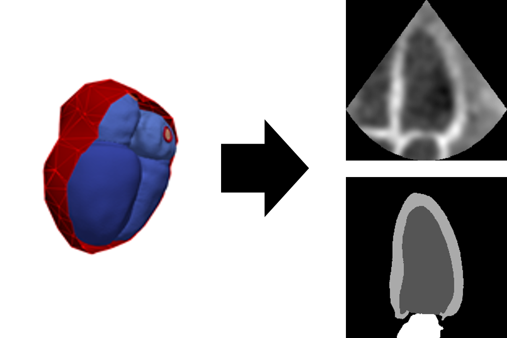
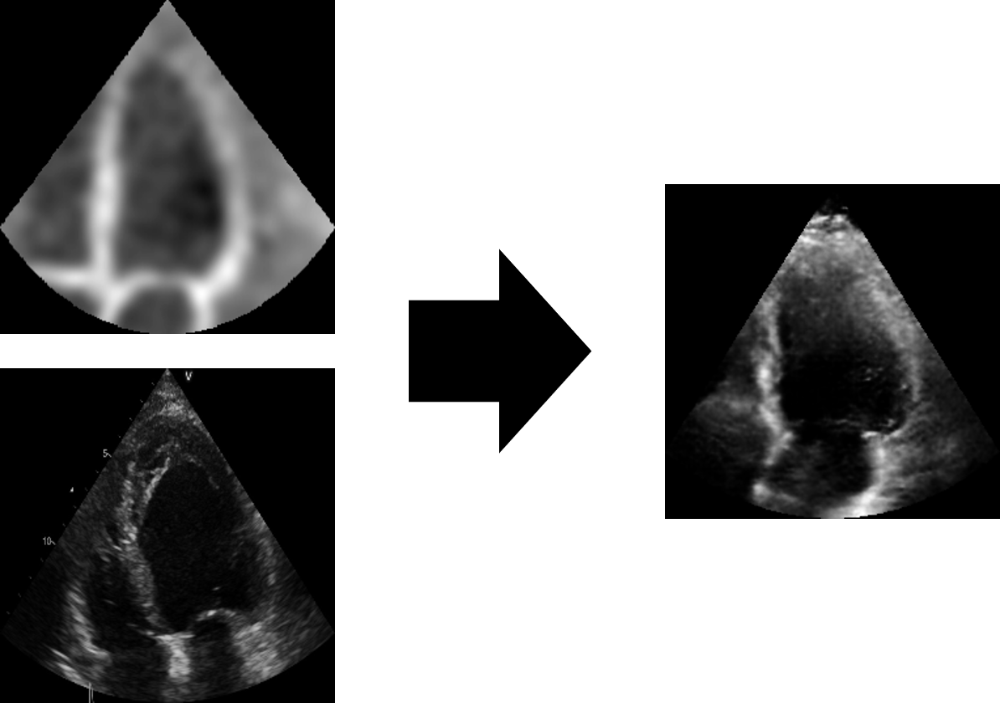
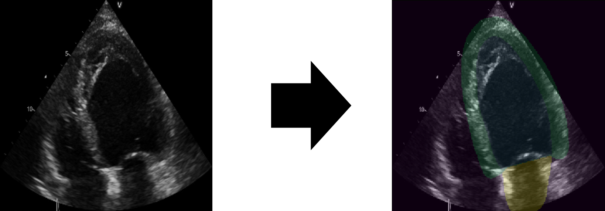

# Generating Synthetic Labeled Data from Existing Anatomical Models

Repository for code from the paper:
"Generating Synthetic Labeled Data from Existing Anatomical Models: An Example with Echocardiography Segmentation"

The anatomical models are available here:  https://zenodo.org/record/4590294#.YbfgcdDMLD4


## Overview

This repository is divided into 4 different submodules. The repository is structured this way because each of these 
pieces is mostly stand-alone. This allows the pieces to be used individually in other contexts and to replace pieces
as the state-of-the-art changes. 

### Initializing submodules

After git cloning the repository an additional step is required to collect the submodules:
```
git submodule init
git submodule update
```


An overview of each piece is given below. See the individual repositories for more information.

## 1-model extension

This submodule is used for extending a small set of anatomical models into a larger set using principal component 
analysis (PCA). Often only a few anatomical models for a given anatomy are available. This repository deconstructs the 
main modes of shape variation and randomly samples from those modes to generate new models.

**Input:** A small set of anatomical models

**Output:** An extended set of anatomical models

## 2-pseudo-image-extraction



This submodule is used for extracting pseudo ultrasound images (and associated labels) from an anatomical model. 
Specifically it provides the implementation for extracting apical four and two chamber images. The infrastructure for adding new views is also provided.

**Input:** One or more anatomical models.

**Output:** A set of pseudo images and associated labels.

## 3-image transformation



This submodule is used for transforming pseudo ultrasound images into realistic ultrasound images using a CycleGAN.

**Input:** A set of pseudo images and a set of real ultrasound images

**Output:** A set of synthetic ultrasound images with paired labels (from step 2)

## 4-segmentation


This submodule is used for segmenting ultrasound images. It can be used with either real ultrasound images or 
the synthetic images generated in the previous step. 

**Input:** A paired set of ultrasound images and labels

**Output:** A trained segmentation network. 

